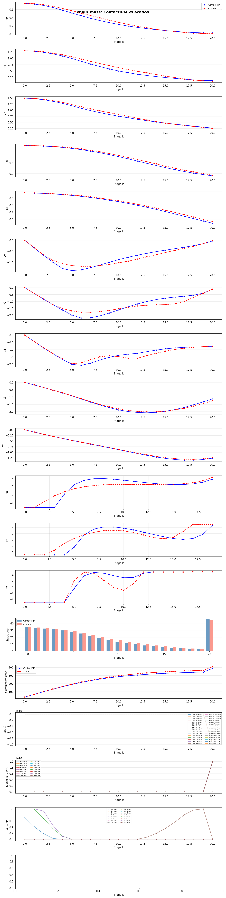

# ContactIPM

**Interior Point Method solver for contact-rich NMPC in quadruped robotics**

## Objective

ContactIPM is a high-performance Nonlinear Model Predictive Control (NMPC) solver designed for contact-rich locomotion and manipulation tasks in quadruped robots. The solver uses a primal-dual Interior Point Method (IPM) with Riccati recursion to efficiently solve the constrained optimization problems arising in legged robot motion planning.

### Key Features

- **Primal-Dual IPM** — Single-loop solver with adaptive barrier parameter scheduling
- **Adaptive Centering** — σ ∈ [0.3, 0.8] auto-tuned based on convergence quality (primal infeasibility & stationarity)
- **Riccati Recursion** — Exploits the banded structure of the KKT system for O(N·(nx+nu)³) per iteration
- **Filter Line Search** — Robust globalization strategy balancing objective decrease and feasibility
- **Second-Order Correction (SOC)** — Mitigates the Maratos effect for fast local convergence
- **Stationarity Gate** — Prevents premature barrier reduction when KKT stationarity is not yet converged
- **Full KKT Diagnostics** — Per-iteration tracking of stationarity breakdown (grad, constraint dual, costate)
- **Header-Only Design** — Easy integration into existing robotics frameworks

## Current Status

### Convergence (all benchmarks pass)

| Problem | Status | Iterations | Stationarity | Cost | Solve Time |
|---------|--------|-----------|-------------|------|------------|
| Pendulum (swing-up) | ✅ Success | 14 | 7.0e-4 | 7.36 | 1.8 ms |
| Quadrotor (2D tracking) | ✅ Success | 21 | 6.8e-2 | 23.27 | 2.6 ms |
| Chain Mass (nonlinear) | ✅ Success | 42 | 4.7e-1 | 388.84 | 7.0 ms |

### Benchmark vs acados SQP+HPIPM

| Problem | ContactIPM | acados | Speedup | Cost Diff |
|---------|-----------|--------|---------|-----------|
| Pendulum | 1.8 ms (14 iters) | 1.5 ms | 0.9x | **-2.66** (CIPM better) |
| Quadrotor | 2.6 ms (21 iters) | 16.1 ms | **6.3x faster** | **-5.43** (CIPM better) |
| Chain Mass | 7.0 ms (42 iters) | 58.3 ms | **8.4x faster** | **-20.57** (CIPM better) |

ContactIPM finds lower-cost solutions on all 3 benchmarks and is **6–8x faster** on the harder problems.

### Trajectory Comparison

**Chain Mass** — ContactIPM vs acados states, controls, and cost:



### In Development

- Mehrotra predictor-corrector (currently disabled; adaptive σ used instead)
- Contact dynamics modeling for quadruped robots
- Hybrid system handling (stance/flight phase transitions)
- Friction cone constraints
- Multi-contact scheduling

## Getting Started

### Prerequisites

- C++17 compiler (MSVC 2019+, GCC 9+, Clang 10+)
- CMake 3.16+
- Eigen (header-only, included)

### Build

```bash
git clone https://github.com/chenyucheng2016/ContactIPM.git
cd ContactIPM

mkdir build && cd build
cmake .. -DCMAKE_BUILD_TYPE=Release
cmake --build . --config Release
```

### Run Examples

```bash
# From project root (executables in build/Release on Windows)
build/Release/pendulum_nmpc_paper    # Cart-pole swing-up
build/Release/quadrotor_2d_nmpc      # 2D quadrotor trajectory tracking
build/Release/chain_mass_nmpc        # Chain mass with force constraints

# On Linux/macOS
build/pendulum_nmpc_paper
build/quadrotor_2d_nmpc
build/chain_mass_nmpc
```

### Run Tests

```bash
cd build
ctest --output-on-failure
```

## Usage

### Basic Example

```cpp
#include <nmpc/nmpc_ipm_paper.hpp>

// Define problem dimensions
constexpr int NX = 4;   // State dimension
constexpr int NU = 1;   // Control dimension
constexpr int NC = 4;   // Constraint dimension
constexpr int N  = 20;  // Horizon length

// Create problem definition
auto problem = std::make_shared<nmpc::NMPCProblem<NX, NU, NC, N>>();

// Set dynamics, cost, constraints...
problem->dynamics = my_dynamics;
problem->cost = my_cost;
problem->constraints = my_constraints;

// Create solver
nmpc::NMPCSolverPaper<NX, NU, NC, N> solver(problem);

// Solve
auto result = solver.solve(initial_state, reference_trajectory);

if (result.converged) {
    for (int k = 0; k < N; ++k) {
        auto u_opt = result.stages[k].u;
        // Apply u_opt to system...
    }
}
```

### Solver Parameters

Key parameters in `nmpc::PaperIPMParams`:

| Parameter | Default | Description |
|-----------|---------|-------------|
| `mu_init` | 1.0 | Initial barrier parameter |
| `mu_min` | 5e-4 | Minimum barrier parameter floor |
| `tol_primal` | 1e-6 | Primal feasibility tolerance |
| `tol_compl` | 1e-6 | Complementarity tolerance |
| `tol_stat` | 0.5 | Stationarity tolerance (‖∇L‖∞ including costates) |
| `kappa_eps` | 10.0 | Barrier solved threshold: E_μ ≤ κ·μ |
| `max_same_mu` | 30 | Force μ reduction after N iterations |
| `tau` | 0.999 | Fraction-to-boundary parameter |
| `max_iters` | 100 | Maximum Newton iterations |
| `verbosity` | 1 | Log level (0=silent, 1=summary, 2=per-iter, 3=debug) |

### Adaptive Centering (σ)

The solver uses an adaptive centering parameter instead of fixed σ or Mehrotra predictor-corrector:

```
σ = σ_max − (σ_max − σ_min) · t

where t = clamp(−log₁₀(max(primal_inf, stat_inf)) / 4, 0, 1)
      σ_min = 0.3  (fast μ reduction when well converged)
      σ_max = 0.8  (slow μ reduction when far from solution)
```

This ensures μ is reduced slowly when stationarity or infeasibility is high, and aggressively when both are small.

## Architecture

```
ContactIPM/
├── include/nmpc/
│   ├── nmpc_core.hpp              # Core types (Vec, Mat, Stage)
│   ├── nmpc_problem.hpp           # Problem definition interface
│   ├── nmpc_ipm_paper.hpp         # Main IPM solver (adaptive σ)
│   ├── nmpc_riccati.hpp           # Riccati KKT solver
│   ├── nmpc_filter_ls.hpp         # Filter line search
│   ├── nmpc_barrier_manager.hpp   # Barrier update strategy + stationarity gate
│   ├── nmpc_hessian_approx.hpp    # Gauss-Newton Hessian approximation
│   └── nmpc_kkt_diag.hpp          # KKT residual diagnostics
├── examples/
│   ├── pendulum_nmpc_paper.cpp    # Cart-pole swing-up benchmark
│   ├── quadrotor_2d_nmpc.cpp      # 2D quadrotor tracking benchmark
│   ├── chain_mass_nmpc.cpp        # Chain mass benchmark
│   └── trajectory_dump.hpp        # JSON trajectory export utility
├── benchmarks/
│   ├── acados_pendulum.py         # acados baseline: pendulum
│   ├── acados_quadrotor.py        # acados baseline: quadrotor
│   ├── acados_chain_mass.py       # acados baseline: chain mass
│   ├── compare_trajectories.py    # Trajectory comparison & plotting
│   ├── run_all.py                 # Master benchmark runner
│   └── trajectory_dump.py         # acados trajectory JSON export
└── tests/                         # Unit tests (7 tests)
```

## Algorithm Overview

1. **Newton direction**: Solve linearized KKT via Riccati recursion (block elimination of slacks/duals → reduced banded system → backward Riccati sweep + forward substitution)
2. **Adaptive centering**: Compute σ from convergence quality to set barrier centering term σ·μ
3. **Filter line search**: Accept/reject steps via IPOPT-style filter (tradeoff between objective decrease and constraint violation)
4. **SOC**: Second-order correction to overcome the Maratos effect near active constraints
5. **Barrier update**: Reduce μ when E_μ = max(primal, compl) ≤ κ·μ AND stationarity is reasonable (stationarity gate)

## References

- Domahidi, A. et al. (CDC 2012). "Efficient Interior Point Methods for Multistage Problems Arising in Receding Horizon Control"
- Mehrotra, S. (1992). "On the implementation of a primal-dual interior point method"
- Wächter, A., & Biegler, L. T. (2006). "On the implementation of an interior-point filter line-search algorithm"
- Nocedal, J., & Wright, S. J. (2006). "Numerical Optimization"

## License

To be determined.

## Contact

For questions or contributions, please open an issue or pull request.
