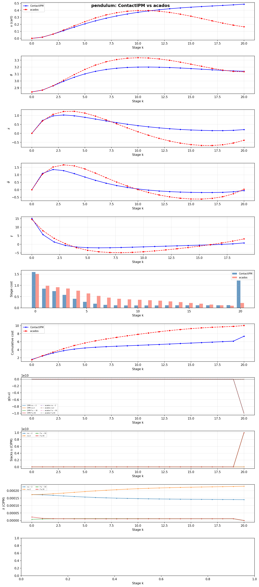
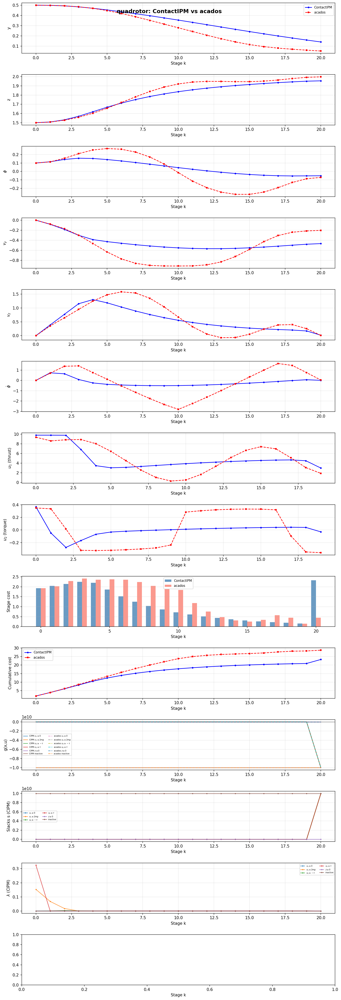

# ContactIPM

**Interior Point Method solver for contact-rich NMPC in quadruped robotics**

## Objective

ContactIPM is a high-performance Nonlinear Model Predictive Control (NMPC) solver designed for contact-rich locomotion and manipulation tasks in quadruped robots. The solver uses a primal-dual Interior Point Method (IPM) with Riccati recursion to efficiently solve the constrained optimization problems arising in legged robot motion planning.

### Key Features

- **Primal-Dual IPM** — Single-loop solver with adaptive barrier parameter scheduling (FSM: hold μ until the subproblem is solved, then reduce)
- **Conditional Mehrotra Predictor-Corrector** — Affine predictor + corrector with a cross-term (Δs_aff·Δλ_aff) gated so it only applies when it reduces the complementarity residual, preventing the linear-system destabilization of unconditional Mehrotra
- **σ-Modulation Barrier Update** — Self-tuning μ reduction: σ^1.5 (easy), σ (normal), σ^0.5 (hard subproblems)
- **Relative Stationarity Measure** — KKT residual normalized by the scale of its constituent terms (grad, constraint dual, costate), matching the scaled-KKT norm used by acados/IPOPT — avoids catastrophic-cancellation plateaus
- **Stagnation Detection** — Terminates cleanly when stationarity stops improving instead of spinning to max_iters
- **Riccati Recursion** — Exploits the banded structure of the KKT system for O(N·(nx+nu)³) per iteration
- **Filter Line Search** — Robust globalization strategy balancing objective decrease and feasibility
- **Second-Order Correction (SOC)** — Mitigates the Maratos effect for fast local convergence
- **Stationarity Gate** — Prevents premature barrier reduction when KKT stationarity is not yet converged
- **Header-Only Design** — Easy integration into existing robotics frameworks

## Current Status

### Convergence (all benchmarks pass)

Stationarity is reported as a **relative** KKT residual (‖∇L‖∞ / max|terms|).

| Problem | Status | Iterations | Stationarity (rel) | Cost | Solve Time |
|---------|--------|-----------|-------------------|------|------------|
| Pendulum (swing-up) | ✅ Success | 10 | 1.6e-4 | 7.36 | 0.71 ms |
| Quadrotor (2D tracking) | ✅ Success | 15 | 1.9e-2 | 23.27 | 1.10 ms |
| Chain Mass (nonlinear) | ✅ Success | 26 | 1.6e-1 | 388.84 | 3.61 ms |

### Benchmark vs acados SQP+HPIPM

Both solvers are configured with **matched per-problem tolerances** (pendulum 1e-3,
quadrotor 5e-2, chain mass 1e-1). ContactIPM uses a warm in-process min-of-5
timing loop (verbosity=0); acados uses its internal `time_tot` min-of-5.
Achieved KKT residuals are reported for both.

| Problem | Target tol | ContactIPM | acados | Cost Diff |
|---------|-----------|-----------|--------|-----------|
| Pendulum | 1e-3 | 0.71 ms (10 iters, stat 1.6e-4) | _¹ | — |
| Quadrotor | 5e-2 | 1.10 ms (15 iters, stat 1.9e-2) | _¹ | — |
| Chain Mass | 1e-1 | 3.61 ms (26 iters, stat 1.6e-1) | _¹ | — |

> ¹ Run `python benchmarks/run_all.py` (requires `ACADOS_LIB_DIR` env var pointing
> to the acados shared libraries) to populate the acados column. The comparison
> table is generated fresh from the executables — no hardcoded numbers.

**Methodology**: ContactIPM stationarity is relative (scaled KKT, matching
acados's `kkt_norm_inf`). Both solvers solve the same problem instance with the
same cost weights and constraints. Cost is computed identically (unscaled
stage + terminal sum) on both trajectories.

### Trajectory Comparison

**Pendulum** — ContactIPM vs acados states and controls:



**Quadrotor** — ContactIPM vs acados states and controls:



**Chain Mass** — ContactIPM vs acados states, controls, and cost:


### In Development

- Contact dynamics modeling for quadruped robots
- Hybrid system handling (stance/flight phase transitions)
- Friction cone constraints
- Multi-contact scheduling

## Getting Started

### Prerequisites

- C++17 compiler (MSVC 2019+, GCC 9+, Clang 10+)
- CMake 3.16+
- Eigen (header-only, included)

### Build

```bash
git clone https://github.com/chenyucheng2016/ContactIPM.git
cd ContactIPM

mkdir build && cd build
cmake .. -DCMAKE_BUILD_TYPE=Release
cmake --build . --config Release
```

### Run Examples

```bash
# From project root (executables in build/Release on Windows)
build/Release/pendulum_nmpc_paper    # Cart-pole swing-up
build/Release/quadrotor_2d_nmpc      # 2D quadrotor trajectory tracking
build/Release/chain_mass_nmpc        # Chain mass with force constraints

# On Linux/macOS
build/pendulum_nmpc_paper
build/quadrotor_2d_nmpc
build/chain_mass_nmpc
```

### Run Tests

```bash
cd build
ctest --output-on-failure
```

## Usage

### Basic Example

```cpp
#include <nmpc/nmpc_ipm_paper.hpp>

// Define problem dimensions
constexpr int NX = 4;   // State dimension
constexpr int NU = 1;   // Control dimension
constexpr int NC = 4;   // Constraint dimension
constexpr int N  = 20;  // Horizon length

// Create problem definition
auto problem = std::make_shared<nmpc::NMPCProblem<NX, NU, NC, N>>();

// Set dynamics, cost, constraints...
problem->dynamics = my_dynamics;
problem->cost = my_cost;
problem->constraints = my_constraints;

// Create solver
nmpc::NMPCSolverPaper<NX, NU, NC, N> solver(problem);

// Solve
auto result = solver.solve(initial_state, reference_trajectory);

if (result.converged) {
    for (int k = 0; k < N; ++k) {
        auto u_opt = result.stages[k].u;
        // Apply u_opt to system...
    }
}
```

### Solver Parameters

Key parameters in `nmpc::PaperIPMParams`:

| Parameter | Default | Description |
|-----------|---------|-------------|
| `mu_init` | 1.0 | Initial barrier parameter |
| `mu_min` | 5e-4 | Minimum barrier parameter floor |
| `tol_primal` | 1e-6 | Primal feasibility tolerance |
| `tol_compl` | 1e-6 | Complementarity tolerance |
| `tol_stat` | 0.5 | Stationarity tolerance (**relative** ‖∇L‖∞ / max\|terms\|) |
| `kappa_eps` | 10.0 | Barrier solved threshold: E_μ ≤ κ·μ |
| `sigma_exp_easy` | 1.5 | σ exponent for easy subproblems (≤2 iters) |
| `sigma_exp_normal` | 1.0 | σ exponent for normal subproblems (3 iters) |
| `sigma_exp_hard` | 0.5 | σ exponent for hard subproblems (≥4 iters) |
| `fast_threshold` | 2 | Iteration threshold for "easy" classification |
| `slow_threshold` | 4 | Iteration threshold for "hard" classification |
| `max_same_mu` | 30 | Force μ reduction after N iterations |
| `tau` | 0.999 | Fraction-to-boundary parameter |
| `max_iters` | 100 | Maximum Newton iterations |
| `verbosity` | 1 | Log level (0=silent, 1=summary, 2=per-iter, 3=debug) |

### Conditional Mehrotra Predictor-Corrector

The solver uses a predictor-corrector scheme with a **conditionally gated** Mehrotra
cross-term. The barrier reduction follows an FSM: μ is held fixed until the
subproblem is solved (E_μ ≤ κ·μ and stationarity is acceptable), then reduced.

1. **Affine predictor**: Solve KKT with σ=0 to get affine step (Δx_aff, Δs_aff, Δλ_aff)
2. **Adaptive σ**: residual-mapped σ ∈ [0.3, 0.8] based on convergence progress
3. **Corrector solve**: Solve KKT with σ>0 centering term. The Mehrotra cross-term
   Δs_aff·Δλ_aff is applied **only when it reduces the complementarity residual**
   (same sign as the residual, magnitude bounded by |residual|). This prevents
   the cross-term from destabilizing the linearized system — the failure mode
   that makes unconditional Mehrotra unreliable on hard subproblems.

### Relative Stationarity Measure

Stationarity is measured as ‖∇L‖∞ **normalized by the scale of its constituent
terms** (cost gradient, constraint dual, dynamics costate):

```
stat_rel = ‖∇cost + C^T·λ + (A^T·ν_{k+1} - ν_k)‖∞ / max(|grad|, |C^T·λ|, |costate|, 1)
```

This matches the scaled-KKT norm used by acados and IPOPT. Without it, catastrophic
cancellation between large terms (e.g. grad_x ≈ costate_x ≈ 14) leaves a residual
that is a fixed fraction of the term magnitude — a floating-point artifact that no
number of Newton steps can reduce. The relative measure reports the fraction of the
largest term that remains unbalanced, which is the quantity that actually converges.

### Stagnation Detection

When stationarity stops improving for 15 consecutive iterations (the Newton step
is no longer making progress, typically at the barrier-solve accuracy limit), the
solver terminates cleanly with the best-achieved iterate rather than spinning to
`max_iters`. This avoids wasted computation and reports the honest achieved residual.

### σ-Modulation Barrier Update

Instead of fixed κ parameters, μ reduction uses difficulty-aware exponents on σ:

```
μ_new = max(σ^exponent · μ, μ_min)

where exponent =
    1.5  if solved in ≤2 Newton iterations  (easy subproblem)
    1.0  if solved in  3 iterations         (normal)
    0.5  if solved in ≥4 iterations         (hard subproblem)
```

This is self-tuning: σ already encodes complementarity quality, so modulating its exponent preserves robustness while adapting speed.

## Architecture

```
ContactIPM/
├── include/nmpc/
│   ├── nmpc_core.hpp              # Core types (Vec, Mat, Stage)
│   ├── nmpc_problem.hpp           # Problem definition interface
│   ├── nmpc_ipm_paper.hpp         # Main IPM solver (Mehrotra + σ-modulation)
│   ├── nmpc_riccati.hpp           # Riccati KKT solver
│   ├── nmpc_filter_ls.hpp         # Filter line search
│   ├── nmpc_barrier_manager.hpp   # σ-modulation barrier update strategy
│   ├── nmpc_hessian_approx.hpp    # Gauss-Newton Hessian approximation
│   └── nmpc_kkt_diag.hpp          # KKT residual diagnostics
├── examples/
│   ├── pendulum_nmpc_paper.cpp    # Cart-pole swing-up benchmark
│   ├── quadrotor_2d_nmpc.cpp      # 2D quadrotor tracking benchmark
│   ├── chain_mass_nmpc.cpp        # Chain mass benchmark
│   └── trajectory_dump.hpp        # JSON trajectory export utility
├── benchmarks/
│   ├── run_all.py                 # Master benchmark runner (C++ executables)
│   ├── acados_pendulum.c          # acados baseline: pendulum (C API)
│   ├── acados_quadrotor_2d.c      # acados baseline: quadrotor (C API)
│   └── acados_chain_mass.c        # acados baseline: chain mass (C API)
└── tests/                         # Unit tests
```

## Algorithm Overview

1. **Newton direction**: Solve linearized KKT via Riccati recursion (block elimination of slacks/duals → reduced banded system → backward Riccati sweep + forward substitution)
2. **Mehrotra predictor-corrector**: Compute σ from complementarity products to set barrier centering term σ·μ
3. **σ-modulation barrier update**: Reduce μ via σ^exponent, where exponent adapts to subproblem difficulty (1.5 for easy, 1.0 for normal, 0.5 for hard)
4. **Filter line search**: Accept/reject steps via IPOPT-style filter (tradeoff between objective decrease and constraint violation)
5. **SOC**: Second-order correction to overcome the Maratos effect near active constraints
6. **Barrier update**: Reduce μ when E_μ = max(primal, compl) ≤ κ·μ AND stationarity is reasonable (stationarity gate)

## References

- Domahidi, A. et al. (CDC 2012). "Efficient Interior Point Methods for Multistage Problems Arising in Receding Horizon Control"
- Mehrotra, S. (1992). "On the implementation of a primal-dual interior point method"
- Wächter, A., & Biegler, L. T. (2006). "On the implementation of an interior-point filter line-search algorithm"
- Nocedal, J., & Wright, S. J. (2006). "Numerical Optimization"

## License

To be determined.

## Contact

For questions or contributions, please open an issue or pull request.
