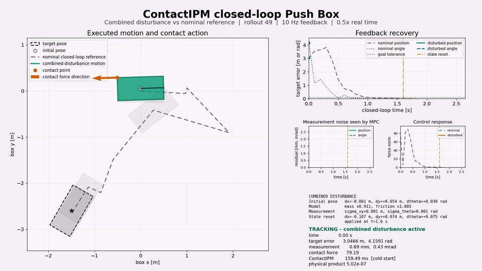

# ContactIPM

**Structure-exploiting interior-point solver for contact-rich optimal control**

ContactIPM solves direct-transcription NMPC and optimal-control problems with
dynamics, bounds, nonlinear inequalities, and complementarity constraints.
Marked complementarity pairs are handled in an elastic interior formulation with
positive slack variables and a logarithmic barrier; they are not treated as a
penalty-only relaxation.
Licensed under the [Apache License 2.0](LICENSE).


## Results

### Compared solvers

- **CRISP** is the sequential-convex contact-implicit motion planner introduced
  in [*On the Surprising Robustness of Sequential Convex Optimization for Contact-Implicit Motion Planning*](https://arxiv.org/abs/2502.01055) ([official code](https://github.com/ComputationalRobotics/CRISP)).
- **IMPACT** is the implicit active-set augmented-Lagrangian solver introduced
  in [*IMPACT: An Implicit Active-Set Augmented Lagrangian for Fast Contact-Implicit Trajectory Optimization*](https://arxiv.org/abs/2605.09127) ([official code](https://github.com/JonasPflaume/IMPACT)).

### ContactIPM versus CRISP

All times were measured locally using adjacent randomized pairs; no times from
the CRISP paper are used. C / R denotes ContactIPM / CRISP. Robustness is
measured once per distinct initial-state/target case. Task quality and timing use
the matched source instances: the task and MPCC columns report the worst audited
value, while objective and wall time report the median over 20 paired runs. Full definitions and distributions are in the
[CRISP result artifacts](benchmarks/contact_ipm/results/2026-07-28_generic_recovery_publication_timing_fast_20x_summary.md)
and the separate [Push T artifact](benchmarks/contact_ipm/results/2026-07-28_generic_recovery_publication_timing_push_t_seg08_20x_summary.md).

| Benchmark | Robustness C / R | Terminal position error C / R | MPCC residual C / R | Objective C / R | Median wall time C / R | Paired CRISP / ContactIPM |
|---|---:|---:|---:|---:|---:|---:|
| Cartpole with Soft Walls | 15/15 / 15/15 | 2.38e-3 / 2.38e-3 | 9.96e-7 / 9.80e-15 | 2.72017 / 2.72017 | 0.0272 / 0.2402 s | 8.868x |
| Push Box | 24/25 / 19/25 | 3.35e-2 / 5.05e-2 | 5.00e-7 / 6.09e-13 | 18.7871 / 6.93078 | 0.2614 / 0.5931 s | 2.168x |
| Transport | 8/15 / 8/15 | 3.39e-5 / 3.55e-5 | 9.51e-7 / 2.74e-12 | 2.96460 / 2.98346 | 0.1967 / 0.4988 s | 2.337x |
| Push T | 50/50 / 27/50 | 1.15e-3 / 6.67e-2 | 9.63e-7 / 1.57e-7 | 4.28988 / 5.64650 | 0.7885 / 5.5285 s | 6.920x |

Across distinct cases, ContactIPM matches CRISP on Cartpole and Transport and
leads on Push Box (24/25 versus 19/25) and Push T (50/50 versus 27/50). On
the jointly valid source instances, ContactIPM is faster in all four benchmarks.
Push Box also shows why objective alone is insufficient: ContactIPM reaches
smaller terminal error despite a larger force-weighted objective.

### ContactIPM versus IMPACT

IMPACT uses a different published parameterization, so these values are kept in
a separate table. `C / I` denotes ContactIPM / IMPACT. Success is measured over
50 predeclared, independently audited instances; objective, tracking, terminal
error, and complementarity are medians over successful instances. Solver time
is the median of 20 locally measured official-case pairs. See the complete
[IMPACT result artifact](benchmarks/impact_comparison/results/2026-07-29_contactipm_vs_impact.md).

| Benchmark | Audited success C / I | Total tracking C / I | Terminal position C / I | MPCC residual C / I | Objective C / I | Median solver time C / I | IMPACT / ContactIPM |
|---|---:|---:|---:|---:|---:|---:|---:|
| Cart Transport | 50/50 / 50/50 | 4837.27 / 280.47 | 5.45e-8 / 1.78e-5 | 9.98e-7 / 2.93e-6 | 1.69e-4 / 2.72e-4 | 0.0366 / 0.1799 s | 4.908x |
| Push Box | 50/50 / 49/50 | 38.80 / 42.04 | 3.63e-5 / 2.83e-5 | 9.98e-7 / 3.15e-6 | 0.0116 / 0.0120 | 0.2666 / 0.0599 s | 0.224x |
| Push T | 50/50 / 48/50 | 12.07 / 13.49 | 2.15e-4 / 5.34e-5 | 1.00e-6 / 1.10e-6 | 0.0453 / 0.0384 | 0.2226 / 0.6645 s | 2.960x |

ContactIPM has higher audited reliability and is faster on Cart Transport and
Push T; IMPACT is faster on Push Box. The Cart Transport trajectory-wide
tracking metric favors IMPACT even though ContactIPM has lower terminal error,
objective, and complementarity residual, so all quality dimensions are reported
rather than reducing the comparison to one scalar.

### ContactIPM versus acados

The acados baseline uses full SQP with `PARTIAL_CONDENSING_HPIPM` and the exact
feasible set `a >= 0`, `b >= 0`, `a*b <= 0`; no complementarity relaxation is
used. Strict success requires acados status 0 and an independently audited
feasible, task-completing trajectory. The CRISP and IMPACT parameterizations
remain separate.

| Parameterization / benchmark | ContactIPM strict | Competitor strict | acados strict |
|---|---:|---:|---:|
| CRISP / Cartpole soft walls | 15/15 | 15/15 | 9/15 |
| CRISP / Push Box | 24/25 | 19/25 | 0/25 |
| CRISP / Transport | 8/15 | 8/15 | 0/15 |
| CRISP / Push T | 50/50 | 27/50 | 0/50 |
| IMPACT / Push Box | 50/50 | 49/50 | 0/50 |
| IMPACT / Push T | 50/50 | 48/50 | 1/50 |
| IMPACT / Cart Transport | 50/50 | 50/50 | 0/50 |

On the eligible CRISP Cartpole source case, median solve time is 27.2 ms for
ContactIPM, 240.2 ms for CRISP, and 952.4 ms for acados. No speed claim is made
for an acados run that fails convergence, feasibility, or task completion. The
[complete three-way report](benchmarks/acados_comparison/results/2026-07-30_side_by_side.md)
records convergence, feasibility, task success, objectives, terminal errors,
complementarity residuals, and median/P90 timing separately.

### Closed-loop contact validation

[](benchmarks/contact_ipm/results/2026-07-30_icra_video/contactipm_push_box_combined_disturbance.mp4)

_Click the preview to open the full 1080p video. The dashed gray path is the
nominal closed-loop reference; the green path is the combined-disturbance motion._

The receding-horizon Push Box suite evaluates feedback robustness under nominal
and disturbed motion. Disturbed motion combines an initial-pose error,
mass/friction mismatch, measurement noise at every feedback update, and one
scheduled `[x, y, theta]` state reset.
The first solve uses zero free-state/control guesses (with stage zero fixed to the
measurement); subsequent solves use shifted warm starts.

| Rollouts | Task success | Solver failures / fallbacks | Solve time median / P90 / P99 | Warm deadline misses | Worst physical MPCC |
|---:|---:|---:|---:|---:|---:|
| 50 | 50/50 | 0 / 0 | 2.08 / 11.5 / 60.8 ms | 2/1054 | 1.01e-6 |

The control period is 100 ms; the two warm-start misses mean this is not a hard real-time claim. See the [full audited summary](benchmarks/contact_ipm/results/2026-07-29_closed_loop_push_box_50_summary.md)
and [reproduction commands](REPRODUCIBILITY.md#8-closed-loop-push-box-validation).

The CRISP Push Box model is quasi-static, so this validates closed-loop
complementarity handling rather than high-fidelity impact dynamics.

## Reproducing the paper comparisons

The repository pins the exact CRISP and IMPACT source revisions as Git
submodules and tracks the frozen benchmark instances, fairness checks,
independent trajectory audits, paired timing runners, and publication-facing
result artifacts.

Start with a recursive clone:

```bash
git clone --recurse-submodules \
  https://github.com/chenyucheng2016/ContactIPM.git
cd ContactIPM
```

Follow [`REPRODUCIBILITY.md`](REPRODUCIBILITY.md) for the complete Ubuntu
setup and copy-paste commands to:

- build and test ContactIPM;
- apply the auditable CRISP instrumentation and build the pinned checkout;
- build unmodified IMPACT with CasADi 3.7.2 and Eigen BLAS/LAPACK;
- build the pinned acados baseline and regenerate its seven contact solvers;
- rerun the exact-instance, robustness, controlled timing, ablation, Pareto,
  and scaling experiments; and
- regenerate and verify the side-by-side tables.

All competitor timings in this repository are locally measured. Values quoted
by the CRISP or IMPACT papers are not used. Exact wall times depend on the
machine, while source revisions, instances, solver outputs, physical audits,
and the randomized adjacent-pair protocol are recorded for verification.

### Reproduce the acados comparison

The exact revision, dependencies, build steps, and timing commands are in the
acados comparison [`README`](benchmarks/acados_comparison/README.md) and
[`manifest`](benchmarks/acados_comparison/acados_manifest.json). After building
the pinned acados, CRISP, and IMPACT revisions, run all benchmark smoke tests
and physical audits from WSL with:

```bash
bash benchmarks/verify_all_benchmark_smoke_wsl.sh \
  "$(realpath ../acados)"
```

### Ordinary CasADi OCP Timing

The Python ContactIPM adapter includes Python/CasADi callback dispatch in its
solve timer. For solver-performance measurements, the same CasADi models and
derivatives are generated as native C callbacks and evaluated inside
`ContactIPM::solve`.

| Problem | Success | Iterations | Objective | Median solve time |
|---------|---------|------------|-----------|-------------------|
| Cart Pendulum | 20/20 | 99 | 21937.8166 | 84.9 ms |
| Quadcopter | 20/20 | 21 | 294.2150 | 42.0 ms |
| Quadcopter Tracking | 20/20 | 70 | 425.7313 | 309.8 ms |
| Hanging Chain 2D | 20/20 | 17 | 392.1330 | 355.3 ms |

These Release-mode WSL measurements use one warmup and 20 repeated solves.
Code generation, compilation, problem construction, and reporting are outside
the timed interval. See [`REPRODUCIBILITY.md`](REPRODUCIBILITY.md#6-native-casadi-benchmark-timing)
for build and run commands.
